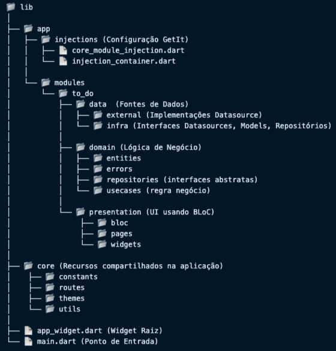
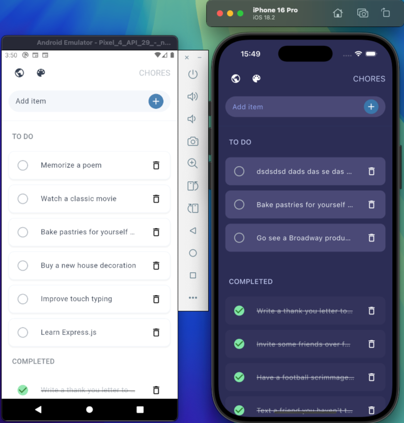
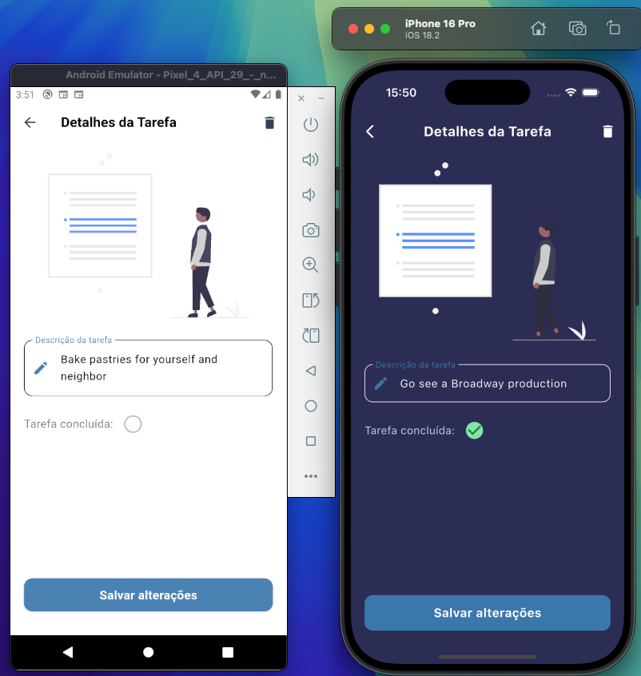

# 📝 ToDo List App (Flutter + Clean Arch + BLoC + GetIt)

Este projeto é uma aplicação Flutter para **Android** e **iOS** implementando padrões como Clean Architecture, gerenciamento de estado com padrão BLoC (Business Logic Component), Injeção de dependências através do GetIt, Tema Nativo com alternância Dark/Light e uma cobertura robusta de **31 testes unitários** incluindo desde as regras de negócio até o Bloc.

💬 Decisões Técnicas:
As escolhas técnicas garantem um projeto escalável, organizado e de fácil manutenção e expansão futura, permitindo adaptação rápida conforme novas demandas e desafios surjam.


## 🌟 Boas Práticas aplicadas:

✅ Separação clara das camadas (Clean Architecture).

✅ Código limpo, modular, e documentado (Clean Dart/Code).

✅ Testes unitários robustos (31 testes aplicados).

✅ Utilização eficiente do BLoC pattern.

✅ Escalabilidade e fácil manutenção do código.

✅ Tema nativo MaterialApp para UI consistente e personalizável.

---

## 🛠️ Tecnologias e Padrões utilizados:

- **Flutter/Dart:** Framework híbrido completo e eficaz para desenvolvimento móvel ágil no iOS e Android.
- **Clean Architecture:** Camadas organizadas (Presentation, Domain e Data), trazendo clareza, flexibilidade e manutenção simplificada.
- **BLoC:** Gerenciamento de estado robusto, assegurando separação eficiente entre interface e lógica de negócio.
- **GetIt:** Biblioteca simples que realiza injeção de dependências, proporcionando código organizado e testável.
- **Testes unitários:** Garantem robustez ao software e segurança para futuras mudanças.
- **Rotas com onGenerateRoute:** Permite um gerenciamento centralizado e dinâmico de rotas, facilitando a navegação e a manutenção do código, especialmente em projetos maiores.

---

## ✅ Funcionalidades Extras Implementadas:

- [x] Dark Mode & Light Mode  
- [x] Armazenamento com Banco de Dados Local  
- [x] Implementação de testes do BLoC    
- [x] Injeção de dependências otimizadas com GetIt  

---

## 📂 Arquitetura do projeto:



---

## ⚙️ Execução do projeto:

> ⚠️ **Pré-requisito:** Flutter instalado na máquina. Caso precise, siga [este guia](https://docs.flutter.dev/get-started/install).

**1. Clone o repositório:**
```bash
git clone https://github.com/natanvalimcardoso/to_do_list_flutter.git
```

**2. Acesse o diretório:**
```bash
cd to_do_list_flutter
```

**3. Obtenha as dependências:**

```bash
flutter pub get
```

**4. Execute o app (dispositivo conectado/emulador):**
```bash
flutter run
```

**5. Execução dos testes unitários:**
```bash
flutter test
```

**🚀 Ideias e Melhorias futuras:**
Se houvesse mais tempo disponível, planejaria implementar:

✅ Internacionalização (i18n): Possibilitando vários idiomas.

✅ Melhorias adicionais UI/UX: Animações, feedback visual refinado e maior interatividade.

✅ Utilizar pacotes mais robusto na criação de modulos como o Modular

## Tela inicial



## Tela de detalhes



**Desenvolvido com 💙 por Natan Valim Cardoso.**